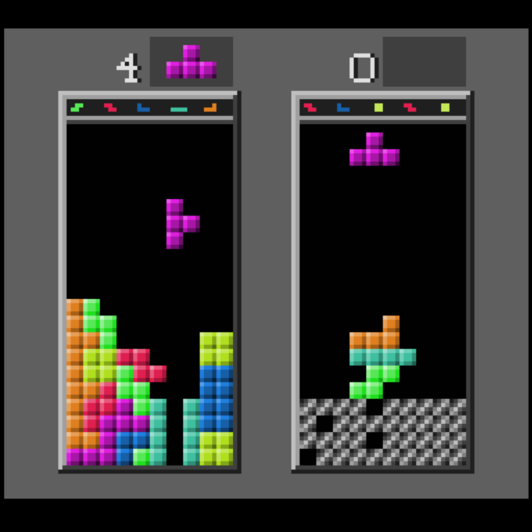

# GameTank Tetris

Implentation of Tetris for the GameTank 8-bit video game console, written in C for the cc65 compiler.

Features:
* SRS rotation (mostly)
* 7-bag randomizer
* Animated preview queue
* Multiplayer
* Line clear counter
* Music

